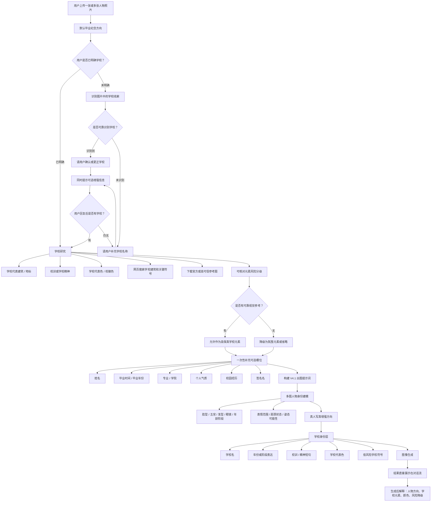
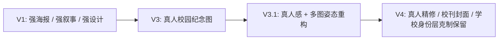

# V4.1 Workflow

V4.1 的业务目标不是单纯生成一张好看人像，而是把用户照片转成“小红书应届毕业纪念场景”里的“真人写真增强 + 学校身份层 + 高保真学校元素”的校园纪念图。

## 总览

## 关键业务节点

### 1. 发布场景

V4.1 先聚焦毕业纪念方向，因为小红书发布场景里的主要用户预期是应届生或准毕业生。

校友回望不作为默认分支。只有用户明确说“校友”“毕业多年”“返校”“回望母校”等表达时，才进入校友方向。

### 2. 学校确认

学校不能靠模型猜完就直接生成。流程必须先从照片里找线索：

- 校名文字
- 校徽 / logo
- 校服或学位服标识
- 建筑门牌
- 毕业典礼背景
- 横幅、纪念墙、校园标识

如果用户已经在请求中明确学校，就不再二次确认，直接进入学校研究。

如果用户没有明确学校，识别到后再确认；识别不到则请用户提供学校名。

### 3. 学校研究

学校确认后再研究学校元素。V4 需要学校身份，但不能为了丰富画面编造学校细节。

研究对象：

- 代表建筑、校门、图书馆、钟楼、雕塑、校园轴线等视觉元素
- 校训或学校精神
- 学校代表色或校徽色
- 正向校友线索
- 任何会被用户检查的可读文字、校徽、年份、建筑外观

如果没有可靠视觉参考，具体建筑和校徽应降级为小元素、线稿、剪影、氛围，或直接省略。V4.1 可以在学校研究阶段多花一点时间，多做一轮网页搜索和参考图收集，以换取更高保真的学校建筑和关键符号。

### 4. 一次性可选槽位

学校确认后，只问一次可选信息，不反复打断：

- 毕业时间 / 毕业年份
- 姓名：中文名或英文名
- 专业 / 学院
- 个人特质或希望呈现的气质
- 校园经历 / 社团经历
- 签名名

用户不补充也继续生成。应届方向默认使用当前年份；如果用户提供月份、季节或具体日期，版面允许时作为小字信息层出现，否则压缩为年份。校友方向不编造毕业年份。

### 5. V4 出图逻辑

V4.1 的核心是“真人写真增强”，不是奇幻海报：

- 多张人物图共同建立身份模型
- 人物必须像本人
- 允许更自然、更适合画面的姿态
- 人脸、皮肤、光线更接近真实精修照片
- 学校元素可见但克制
- 不丢学校名、年份、校训/精神短句、校色和低风险学校符号

## V4 和前面版本的区别

V4 当前应该锁定的方向：

- 最像真人 P 图
- 最干净
- 最接近学校官方画册或校刊封面
- 学校身份层不能丢
- 不走奇幻、梦幻水彩、电影概念海报路线

## 风险点

- 如果脚手架统一写入强风格词，V4 会被拉回海报风。
- 如果只强调写真，V4 会丢学校名、校训、校色和校园符号。
- 如果学校元素做得太大，校徽和建筑容易错。
- 如果多图建模只抓一张图，姿态会单调且像原图复刻。
- 如果手部、证书、书本成为焦点，人体结构风险会上升。
